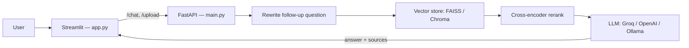

# RAG Chatbot

A full-stack conversational RAG (Retrieval-Augmented Generation) system that lets you upload your own documents and ask grounded, source-cited questions about them — built with a FastAPI backend and a Streamlit chat interface.

## 🚀 Features

- 💬 **Conversational Q&A** — Multi-turn chat with follow-up question rewriting, so "what about the second one?" resolves correctly against prior turns
- 📄 **Multi-format ingestion** — Upload PDF, TXT, DOCX, CSV, and XLSX files directly from the UI
- 🔍 **Grounded, cited answers** — Every answer is traceable to retrieved chunks; the model is instructed to say "I don't know" rather than guess, and sources are shown with similarity scores
- 🎯 **Cross-encoder reranking** — Over-fetches candidates from the vector store, then reranks with a cross-encoder for higher-precision top-k context (`RERANK_ENABLED=true` by default)
- 🗄️ **Swappable vector store** — FAISS or ChromaDB, selected via a single environment variable
- 🔌 **Pluggable LLM provider** — Groq, OpenAI, or local Ollama, selected via a single environment variable
- 🛡️ **Hardened API** — Per-IP rate limiting, CORS allow-listing, upload size/type validation, and prompt-injection-resistant system prompts
- 🧪 **Built-in evaluation** — A RAGAS-based faithfulness/relevancy/precision/recall harness and a 10-question adversarial red-team suite (prompt injection, fabrication bait, cross-document conflation)

## 🏗️ Architecture



**Flow:** a user's question is rewritten into a standalone query using recent chat history → embedded and searched against the vector store → the top candidates are reranked by a cross-encoder → the best chunks are inserted into a grounding prompt → the LLM generates an answer that is returned with its supporting sources (document, page, similarity score).

## 📦 Repo layout

```
.
├── app.py                      # Streamlit frontend (chat UI, file upload)
├── main.py                     # FastAPI backend (/chat, /upload, /status, /ping)
├── config.py / config.json     # Backend host/port/URL configuration
├── build_vectorstore.py        # One-off script to bulk-ingest data/ into the vector store
├── ragas_eval.py                # RAGAS faithfulness/relevancy/precision/recall harness
├── test_rag_chatbot.py         # Adversarial / red-team test suite (prompt injection, etc.)
│
├── llm/
│   ├── llm_factory.py          # Provider switch: Groq / OpenAI / Ollama
│   ├── answer_generation.py    # Core RAG pipeline (rewrite → retrieve → rerank → generate)
│   └── reranker.py             # Cross-encoder reranking
│
├── file_processing/
│   ├── ingest.py               # PDF / TXT / DOCX loaders
│   ├── tabular_loader.py       # CSV / XLSX loaders (auto header-row detection)
│   ├── chunking.py             # Recursive character text splitting
│   └── embeddings.py           # sentence-transformers embedding + similarity utilities
│
├── vector_db/
│   ├── vector_store_factory.py # Provider switch: FAISS / Chroma
│   ├── faiss_store.py          # FAISS-backed store (IndexFlatIP, cosine via normalized vectors)
│   └── chroma_store.py         # ChromaDB-backed store
│
├── prompts/
│   ├── rag_prompt.md           # Grounding / answer-generation system prompt
│   └── query_rewriter_prompt.md # Standalone-question rewriting prompt
│
├── tests/                      # pytest unit tests (chunking, embeddings, ingest, vector store, API)
├── conftest.py                 # Shared fixtures; stubs sentence-transformers for offline tests
├── pytest.ini
│
├── data/        (gitignored)   # Uploaded / ingested source documents
├── debug/       (gitignored)   # Per-request debug logs (retrieval, prompts, RAGAS reports)
├── faiss_db/    (gitignored)   # FAISS index + metadata persistence
├── chroma_db/   (gitignored)   # Chroma persistence
│
├── docker-compose.yml
├── requirements.txt
└── README.md
```

## ⚙️ Setup (local)

### Prerequisites
- Python 3.10+
- Docker & Docker Compose (recommended path)
- An API key for at least one LLM provider (Groq, OpenAI) — or a local Ollama install

### Option A — Docker Compose (recommended)

```bash
git clone <repo-url>
cd rag-chatbot
cp .env.example .env        # fill in GROQ_API_KEY / OPENAI_API_KEY / VECTOR_DB etc.
docker compose up --build
```

- Frontend → http://localhost:8501
- Backend health → http://localhost:8000/status

### Option B — Run locally without Docker

```bash
pip install -r requirements.txt

# One-time: populate the vector store from anything already in data/
python build_vectorstore.py

# Terminal 1 — backend
python main.py

# Terminal 2 — frontend
streamlit run app.py
```

## 🔧 Environment variables

| Variable | Required | Default | Purpose |
|---|---|---|---|
| `BACKEND_URL` | No | `http://localhost:8000` | Base URL the Streamlit frontend calls |
| `BACKEND_HOST` / `BACKEND_PORT` | No | `0.0.0.0` / `8000` | FastAPI bind address |
| `CORS_ORIGINS` | No | `http://localhost:8501` | Comma-separated list of allowed frontend origins |
| `VECTOR_DB` | **Yes** | — | `faiss` or `chroma` |
| `RERANK_ENABLED` | No | `true` | Toggle cross-encoder reranking |
| `RETRIEVE_K` | No | `10` | Candidates over-fetched before reranking |
| `RERANKER_MODEL` | No | `cross-encoder/ms-marco-MiniLM-L-6-v2` | HuggingFace cross-encoder used for reranking |
| `LLM_PROVIDER` | No | `ollama` | `ollama`, `openai`, or `groq` |
| `OLLAMA_MODEL` | No | `llama3.2:3b` | Used when `LLM_PROVIDER=ollama` |
| `OPENAI_API_KEY` / `OPENAI_MODEL` | Only if using OpenAI | — / `gpt-4.1-mini` | OpenAI provider config |
| `GROQ_API_KEY` / `GROQ_MODEL` | Only if using Groq | — / `llama-3.3-70b-versatile` | Groq provider config |
| `MAX_QUESTION_LENGTH` | No | `2000` | Max characters accepted by `/chat` |
| `MAX_UPLOAD_SIZE_MB` | No | `20` | Max upload size for `/upload` |
| `CHAT_RATE_LIMIT` | No | `10/minute` | Per-IP rate limit on `/chat` |
| `UPLOAD_RATE_LIMIT` | No | `30/minute` | Per-IP rate limit on `/upload` |
| `RAGAS_EMBEDDING_MODEL` | No | `sentence-transformers/all-MiniLM-L6-v2` | Embedding model used by the RAGAS eval harness |

## 🧪 Testing

```bash
pytest
```

Covers document loading, chunking, embeddings, the FAISS vector store (including a regression test for a delete-then-search crash), and the FastAPI endpoints via mocked LLM/vector store fixtures — fully offline, no real model or provider calls.

### Quality evaluation

```bash
python ragas_eval.py --label after
```

Runs a 10-question ground-truth set against the live `/chat` endpoint and scores faithfulness, answer relevancy, context precision, and context recall via RAGAS. Reports go to `debug/ragas_report.md`; running averages are appended to `debug/ragas_history.csv`.

### Adversarial / red-team testing

```bash
python test_rag_chatbot.py --label after
```

Fires 10 adversarial questions at the live `/chat` endpoint — out-of-scope bait, fabricated-policy bait, direct and embedded prompt injection, fake-authority injection, and cross-document conflation — plus one grounded control question. Full transcript written to `debug/adversarial_test_log.md`.

## 🔍 Advanced retrieval

Cross-encoder reranking is on by default (`RERANK_ENABLED=true`): the retriever over-fetches `RETRIEVE_K` candidates, then a cross-encoder rescoring pass narrows them down to the top 3 before they're inserted into the prompt. See `debug/ragas_history.csv` for faithfulness/precision scores before vs. after enabling it.

## ⚠️ Known limitations

- FAISS index is a single local file — no concurrent-writer safety.
- The Ollama provider only works when run locally; it isn't available on free-tier hosting.
- No auth on `/upload` — anyone with the URL can add documents to the knowledge base.
- Rate limits are per-IP and reset on backend restart (in-memory, not persisted).
- Debug logs under `debug/` can accumulate full prompts and retrieved chunks — don't point `DEBUG_DIR` at anything containing sensitive documents in a shared environment.

## 🌐 Live demo

- Frontend: https://wyytcswxrglccxy8bkkyze.streamlit.app/
- Backend: hosted on Railway's free tier, which is usage-capped. The backend may go to sleep or stop responding once the monthly credit is exhausted — if the demo looks unresponsive, this is the most likely reason. For guaranteed access, run it locally via the Docker Compose setup above.

## 🛠️ Tech stack

**Frontend** — Streamlit
**Backend** — FastAPI, slowapi (rate limiting)
**Retrieval** — FAISS / ChromaDB, sentence-transformers, cross-encoder reranking
**LLM** — Groq / OpenAI / Ollama via LangChain
**Evaluation** — RAGAS
**Testing** — pytest
**Deployment** — Docker Compose (Streamlit frontend + FastAPI backend as separate services)
